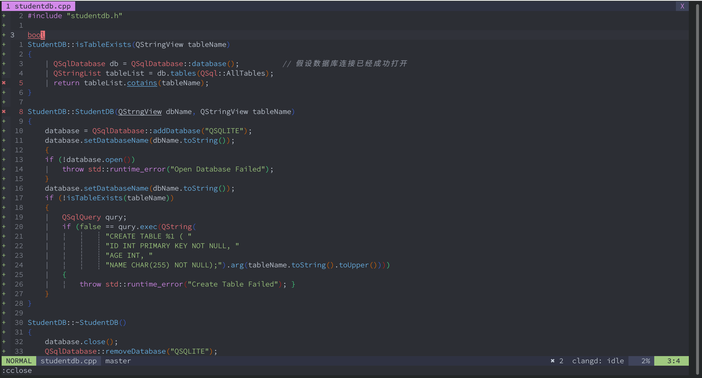
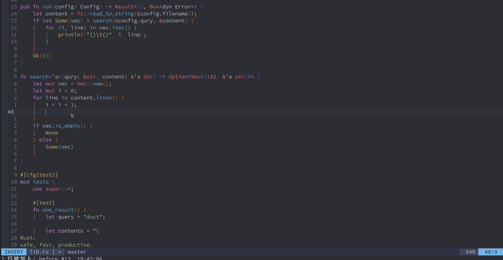
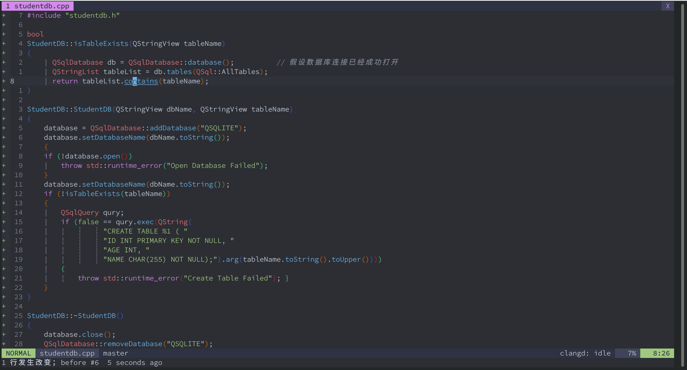
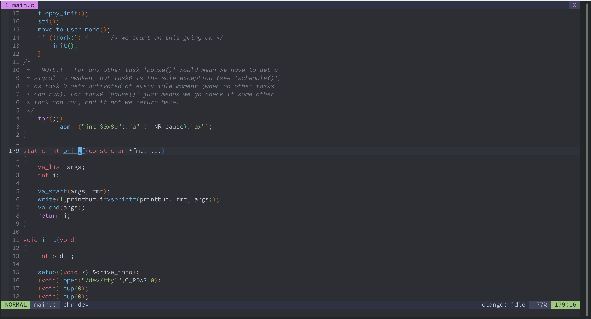
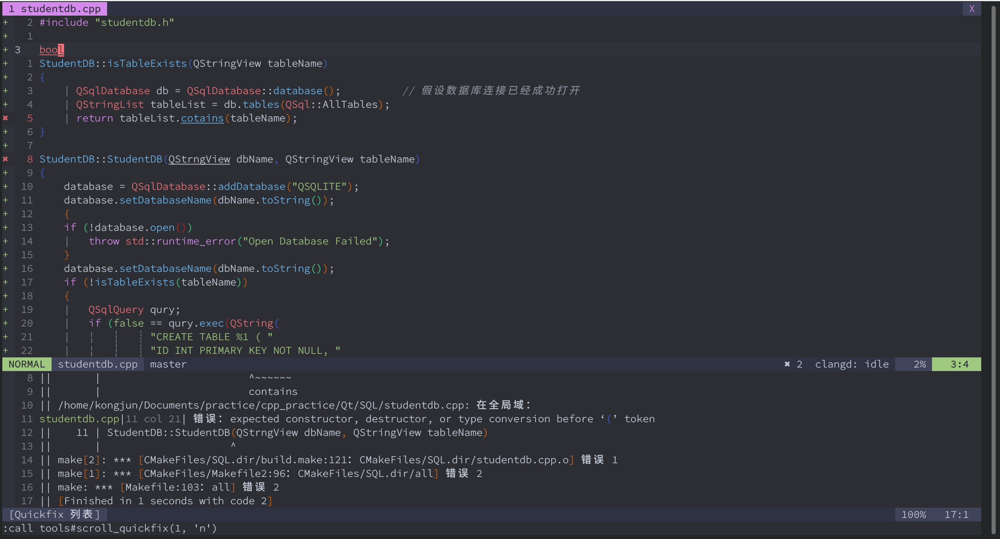
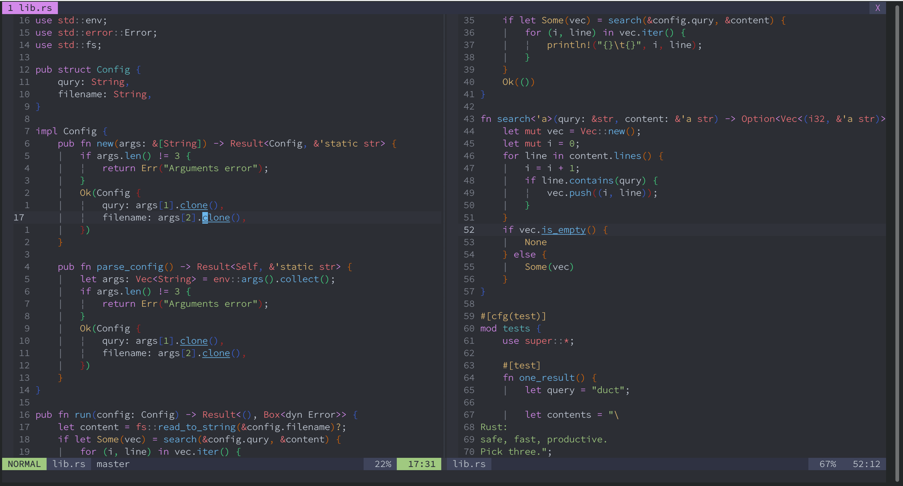
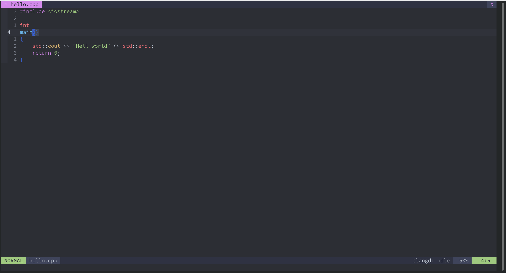
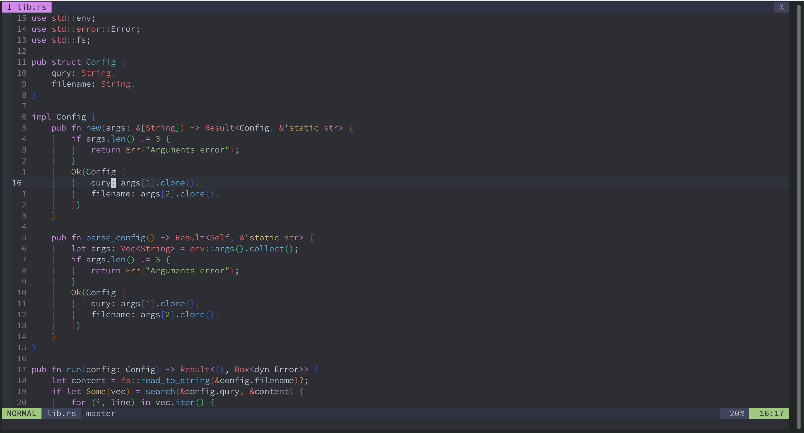
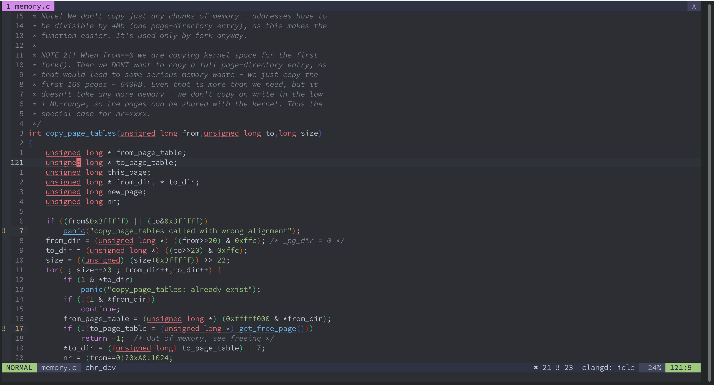
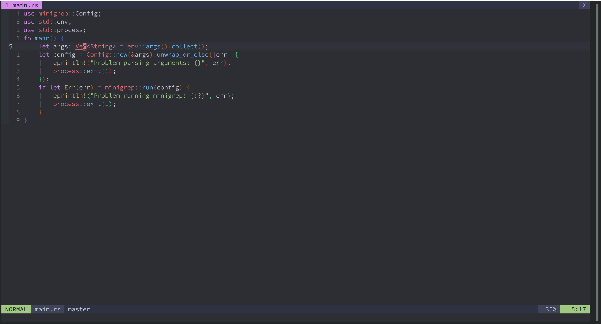

# A (neo)vim configuration for C/C++ and Rust development
This repository is my personal configuration of (Neo)vim.

If you want a community-driven configuration, please see [Spacevim](https://github.com/SpaceVim/SpaceVim).

## Feature
My (Neo)vim is configured for C/C++ and Rust. It supports Vim and Neovim and can run in any GNU/Linux distributions, Windows and FreeBSD.

Feature list:

- build and run project in Vim
- code completion
- dynamic check
- git support
- jump to definition/reference/implementation/alignment and so on 
- scroll window and quickfix without change focus
- disassembly current C/C++ file
- fuzzy finder
- operate window, buffer and tab at ease

## Requirement

Compulsory:
- Vim 8.1.2269+ or Neovim 4.4+ with python3 support
- Node 10.12+:          for coc.nvim
- [ccls](https://github.com/MaskRay/ccls):                C++ LSP
- curl or wget:        downloader used by dein.nvim
- git:                 downloader used by dein.nvim
- Python3.6+:          for [Ultisnips](https://github.com/SirVer/ultisnips), [LeaderF](https://github.com/Yggdroot/LeaderF) and other plugins
- [universal ctags](https://github.com/universal-ctags/ctags):     generate tag file
- Source Code Pro(GUI): a nice programmer font


Optional:
- Latest **Neovim nightly** with Python3 support
- [cygwin(Windows)](https://www.cygwin.com): a large collection of GNU tools
- [rg(ripgrep)](https://github.com/BurntSushi/ripgrep):         a better grep
- [fd](https://github.com/sharkdp/fd):                  a faster find
- [gtags](https://www.gnu.org/software/global/):               find reference, included file and so on
- [pygments](https://pygments.org):            extend gtags' functionality
- clang-format:        format C/C++ code
- clang-tidy, clazy:   C++ linter
- [bear](https://github.com/rizsotto/Bear):                generate compile database for Makefile
- axel:                a multi-threaded downloader 
- [nerd-fonts](https://github.com/ryanoasis/nerd-fonts): display icons
- C++ compler:        compile [nvim-treesitter](https://github.com/nvim-treesitter/nvim-treesitter)


[neovim nightly](https://github.com/neovim/neovim/releases) and [cygwin](https://www.cygwin.com) are highly recommended.

Notes:

- UNIX: Python executable must be placed in /usr/bin
- Windows: Some features related to utils.vim and tools.vim are not available

## Installation

Please backup your configuration and follow the instructions below to install my configuration. When you launch vim, it will install plugins automatically. If the networking is working correctly, you just need to wait 3 minutes.

### UNIX

Clone it, run `sh install.sh` in shell and then open (Neo)vim.
```sh
git clone https://github.com/kongjun18/nvim-config.git
sh nvim-config/install.sh
```

### Windows

Open cmd.exe with administrator right, and type the following commands:

```shell
cd %HOME%
git clone https://github.com/kongjun18/nvim-config.git
copy nvim-config\install.bat
install.bat
```

When launch vim, you will see nothing(as if vim is not lauched). Don't panic, open task manager, you can see many Git processes, which indicates Vim is installing plugins.


## Structure of configuration

```
.
├── after
│ 	└── ftplugin
│		├── fish.vim
│		├── jsonc.vim
│		├── lua.vim
│		├── markdown.vim
│		├── qf.vim
│		├── rust.vim
│		└── vimwiki.vim
├── autoload
│ 	├── tools.vim
|   └──general.vim
├── coc-settings.json
├── colors
|   ├── github.vim
|   └── edge.vim
├── init.vim
├── install.sh
├── install.bat
├── plugin
│   ├── command.vim
│   └── keymap.vim
├── LICENSE
├── plugged
├── README.md
├── spell
├── tasks.ini
│   ├── dein.sh
│   ├── gitignore/
│   └── Qt/
└── UltiSnips
    ├── cmake.snippets
    ├── cpp.snippets
    ├── c.snippets
    ├── lua.snippets
    ├── rust.snippets
    └── vim.snippets
```

- after/ftplugin: Filetype-specific setting.
- autoload: Some tools written in VimL.
- coc-setting.json: Configuration of coc.nvim.
- colors: Color scheme.
- init.vim: Configuration file of (Neo)vim.
- plugin/keymap.vim: Plugin-independent key mappings.
- plugin/command.vim: commands
- spell: Spell files. They may be no use to you.
- autoload/tools.vim : Some tools such as gitignore templates.
- autoload/general.vim: General settings 
- UltiSnips: Snippets. 

## Usage

Leader:`<Space>`

Localleader: `z`

I use `general#project_root_maker`(`['.root', '.pro', 'Cargo.toml', 'compile_commands.json', '.git']`) to identify the root of project. Thus, you must define one of these files at the root of project.

For more information, you need to read source code. README.md only describes key points of my configuration.

### Manage plugins

I manage plagins using [dein.vim](https://github.com/Shougo/dein.vim). It is fast and powerful but not easy-to-use for new vimmer.

Because dein.vim only provides functions, I add some simple commands.

|     command     |                     description                     |
| :-------------: | :-------------------------------------------------: |
|   PluginClean   |               clean not-used plugins                |
|  PluginInstall  | install plugins added by dein.vim but not installed |
|  PluginUpdate   |                 update all plugins                  |
|  PluginRecache  |             recache plugin directories              |
| PluginReinstall |                  reinstall plugins                  |

### Build and run project in (Neo)vim

Use [Asynctask](https://github.com/skywind3000/asynctasks.vim) to manage task. All tasks in ~/.config/nvim/tasks.ini. The following table shows some frequently-used tasks.

|                  task                   | mapping |                       description                    |
| :-------------------------------------: | :-----: | :--------------------------------------------------: |
|               file-build                | \<Tab>5  |                  build current file                  |
|                file-run                 | \<Tab>6  |                   run current file                   |
|              project-build              | \<Tab>7  |             build current C/C++ project              |
|               project-run               | \<Tab>8  | run executable with the same name of current project |
|              project-clean              | \<Tab>9  |                clean current project                 |
| generate-compile-database-from-makefile |  None   |              generate compile database               |
| clang-tidy | None | lint current project |

Project-related tasks are defined for C/C++ project based on CMake. But  I also defined some [profiles](https://github.com/skywind3000/asynctasks.vim#task-with-different-profiles) to support diffrent tool chains(such as Makefile). If my tasks don't meet your demand, please modify it.

I add custom command `:TaskEdit` to edit global asynctask configuration. You also can use `:AsyncTaskEdit` to edit global or local asynctask configuration.

If you want to handle project-specific asynctask configuration, please type `:AsynctaskEdit` and write your configuration based on global tasks.ini.

I don't want to define mapping for every task, but i integrate [Leaderf](https://github.com/Yggdroot/LeaderF) and Asynctask. You can type `<Leaderf>lt` to find and run any tasks conveniently.

**Note:** 

- For some unknown reasons, If edit Rust file in directory which is not the root of project, run `cargo build` (task `project-build:cargo`) and then jump to file in quickfix, we will jump to empty file. So always edit Rust file in the root of project.
- task clang-tidy depends on UNIX find



### Code completion

Use [coc.nvim](https://github.com/neoclide/coc.nvim) to complete and lint code. For Rust, It can be used out of box. 

Use \<Tab> to select suggestions. \<C-n> select next suggestions and \<C-p> select previous one.

For C/C++, You should generate [compile database](https://www.jetbrains.com/help/clion/compilation-database.html)(compile_command.json) and place it at the root of C/C++ project. If you use CMake or Makefile, my configuration handles it for you. Please check aformentioned `project-configurate` and `generate-compile-database-from-makefile`.

coc.nvim has full capability of LSP(language server protocal). Theoretically, coc.nvim supports all LSP. If you want to write other language(such as Lua), just find the corresponding LSP and configure coc.nvim.



### Dynamic check

See [code completion](https://github.com/kongjun18/nvim-config#code-completion).



### Source code tagging system

I use both static analysis tools([global(gtags)](https://www.gnu.org/software/global/) and [universial-ctags](https://github.com/universal-ctags/ctags)) and coc.nvim to index source code.

static analysis tag system like gtags and ctags is powerful, scalable, but not smart enough. Gtags(integrated with [pygment](https://pygments.org/)) supports more than 50 languages and proficient in searching definition, symbol, reference, alignment, calling function, called function, including file. Ctags support more than 200 languages, but only proficient in searching definition. Both gtags and ctags are based on static symbol analysis, if you search overloaded function, you will get many functions with same name and need to select the correct one manually. 

LSP-based tag system like functionalities coc.nvim provides is smart but not powerful enough. coc.nvim only supports reference, definition. I use coc.nvim to find definition and reference, use static tagging system find other things.

Mappings related to tag is similar to [cscope](http://cscope.sourceforge.net/) except  go to definition and go to including file. 

|       mapping       |                         description                          |
| :-----------------: | :----------------------------------------------------------: |
|         gd          |                       go to definition                       |
|         gs          |                   go to symbol(reference)                    |
|         gf          |                          go to file                          |
|         gi          |     go to implementation(Rust) or including file(C/C++)      |
|         ga          |          go to places where this symbol is assigned          |
|         gc          |            go to functions calling this function             |
|         gC          |           go to functions called by this function            |
|         gt          | go to places where match this text(gtags) or go to type definition(coc.nvim) |
|         ge          |         go to places where match this egrep pattern          |
|       \<C-g>        |     go to definition or reference using gtags directory      |
| \<Localleader>p(zp) |  preview definition of symbol under cursor in pop up window  |
| p(type in quickfix) |                 preview tag in pop up window                 |

By default, `gd`,  `gs` , `gt`, `gc` and `gC` use coc.nvim. If you don't want to use LSP-based tag, please set `g:only_use_static_tag` (defined in fold *general setting*, init.vim) to `1`. Besides, you can type `:UseStaticTag` to switch to static tag system in  Vim. 

I use [vim-gutentags](https://github.com/ludovicchabant/vim-gutentags) and [vim-gutentags_plugs](https://github.com/skywind3000/gutentags_plus) to manage tag file.

Every time open or write file belong to project, Vim will generate ctags and gtags incrementally. 

Sometimes, gutentags fails to generate gtags or ctags file and produce warning. You can type `:DebugGutentags` to see log, fix the problem and type `:UndebugGutags` to disable messages. In most case, delete gtags file fix all problems. All tags are stored in ~/.config/.cache/tags. I write a function `tools#rm_gtags(dir)` to delete gtags. To delete gtags of current project, type the following line:

```vim
:call tools#rm_gtags(asyncrun#get_root('%'))
```

**Note**: LSP-based tag system consumes more memory and CPU than static tag system. If you use languages which don't support overloaded function, static tag system is better.



### Switch between source and header

[projectionist.vim](https://github.com/tpope/vim-projectionist) finishes this task perfectly except that vim will generate error when we switch buffer without save. I create  `:W` to save the current buffer and switch to corresponding file.

### Scroll adjacent window and quickfix without change focus

I write two simple function `tools#scroll_adjacent_window()` and `tools#scroll_quickfix()` to scroll adjacent window and quickfix without change focus.

Sometimes I vertical split window. One window is used to write code, one window is used to read code. `tools#scroll_adjacent_window()` make me avoid change focus to scroll window and improve my experience.

Quickfix is too small to read error one eye. I used to move to quickfix and scroll it frequently before I write `tools#scroll_quickfix()`. It is a life-changer for me.

| mapping |           description           |
| :-----: | :-----------------------------: |
|  ALT+P  |  scroll up the adjacent window  |
|  ALT+M  | scroll down the adjacent window |
|  ALT+U  |  scroll up the quickfix window  |
|  ALT+D  | scroll down the quickfix window |

Implementation detail see keymap/window.vim and autoload/tools.vim

**Note**: You can use them in insert mode.





### Disassembly current C/C++ file

`tools#disassembly()` is used to disassembly current C/C++ file. It need the following UNIX tools:

- gcc
- objdump

I have created a command `:Disassembly` for it.

`tools#disassembly()` is implemented synchronously. But up to now, I think its performance is acceptable. Once I think it is tool slow to bear, I will try to rewrite it asynchronously.




### Fuzzy finder

Use [LeaderF](https://github.com/Yggdroot/LeaderF) to fuzzy find everything.

If there are [ripgrep](https://github.com/BurntSushi/ripgrep/) and [fd](https://github.com/sharkdp/fd), use them as low-level tools of LeaderF. Otherwise, use grep and find.

|   mapping    |                    description                     |
| :----------: | :------------------------------------------------: |
| \<Leaderf>f  |         Find files in the current project          |
| \<Leaderf>T  |           Find available Asynctask task            |
| \<Leaderf>d  |  Find symbol in the current project(using ctags)   |
| \<LeaderF>p  |        Find function in the current buffer         |
| \<LeaderF>l  |         Find symbol in the current buffer          |
| \<Leaderf>bl |                    Find buffer                     |
| \<Leaderf>rg | Use ripgrep to find pattern in the current project |
| \<Leaderf>tt |                  Toggle NERDTree                   |


### Operate window

Vim provides powerful window operations, but is not relaxing. If you want to operate window, you need to type CTRL+W many times, especially when operate other window. I define some mappings and some simple scripts to operate window at ease.

All mappings are defined in keymap/window.vim. I substitute CTRL+W with \<Leader>+w and make mappings easier to remember.

Move, close window:

|   mapping    |         description          |
| :----------: | :--------------------------: |
| \<Leader>wo  | only sustain current window  |
| \<Leader>wq  |     quit current window      |
| \<Leader>wjq |      quit below window       |
| \<Leader>wkq |      quit upper window       |
| \<Leader>whq |       quit left window       |
| \<Leader>wlq |      quit right window       |
| \<Leader>wh  |     hide current window      |
| \<Leader>whh |       hide left window       |
| \<Leader>wjh |      hide below window       |
| \<Leader>wkh |      hide upper window       |
| \<Leader>wlh |       hide left window       |
| \<Leader>wH  | move current window to left  |
| \<Leader>wL  | move current window to right |
| \<Leader>wJ  | move current window to below |
| \<Leader>wK  | move current window to upper |
|      H       |     move to left window      |
|      L       |     move to right window     |
|      J       |     move to below window     |
|      K       |     move to upper window     |

Resize, split window:

|   mapping   |          description           |
| :---------: | :----------------------------: |
| \<Leader>wv | vertical split current window  |
| \<Leader>ws |      split current window      |
| \<Leader>wt |   move current window to tab   |
| \<Leader>w- | decrease current window height |
| \<Leader>w= | increase current window height |
| \<Leader>w, | decrease current window width  |
| \<Leader>w. | increase current window width  |

**Note:**`,` is the same key with `<` but easier to type, so I substitute `<` with `,`. Likewise, I use `=` substitute `+`.

Buffer mappings:

|     mapping     |         description          |
| :-------------: | :--------------------------: |
|   \<Leader>bd   |    delete current buffer     |
| \<Leader>\<Tab> | switch to alternative buffer |

Tab mappings:

|    mapping     |      description       |
| :------------: | :--------------------: |
| \<Leader>1 ~ 9 |  switch to tab 1 ~ 9   |
|   \<Leader>-   | switch to previous tab |
|   \<Leader>=   |   switch to next tab   |



### Comment and uncomment

Use [NerdCommemter](https://github.com/preservim/nerdcommenter) to comment/uncomment code.

|  mappings   |     description      |
| :---------: | :------------------: |
| \<Leader>cc |    comment lines     |
| \<Leader>cu |   uncomment lines    |
| \<Leader>cs |     sexy comment     |
| \<Leader>ca | change comment style |

NerdCommenter is the best commenter I have ever seen. It supports fine-grained control and is easy to use. Please read the doc of NerdCommenter.



### Open document

[vim-man](https://github.com/vim-utils/vim-man) enables viewing and navigating manual pages in Vim. coc.nvim enables viewing API doc in pop up window.

| mapping |                  description                  |
| :-----: | :-------------------------------------------: |
|   gm    |          vertical open manual pages           |
|   gh    |            vertical open vim help             |
|   gK    | open document in pop up window using coc.nvim |



### Git support

- [gv.vim](https://github.com/junegunn/gv.vim): browse git commit history
- [vim-fugitive](https://github.com/tpope/vim-fugitive): use git in Vim
- [vim-gitgutter](https://github.com/airblade/vim-gitgutter): show git diff in the sign column

There's no need to create mappings for vim-fugitive which has a nice command interface.  So I only define mappings for vim-gitgutter.

| mapping |      description      |
| :-----: | :-------------------: |
|   ghp   |     preview hunk      |
|   ghs   |      stage hunk       |
|   ghu   |       undo hunk       |
|   [c    | jump to previous hunk |
|   ]c    |   jump to next hunk   |


## Problem and Solution

1. When I set paste, something goes wrong

   When paste is set, [Ultisnippet](https://github.com/SirVer/ultisnips) and coc.nvim go wrong. So only set paste when pasting text.

2. When I paste text, indent goes wrong

   You should set paste when pasting text. You can type `setlocal paste` or use [vim-unimpaired](https://github.com/tpope/vim-unimpaired/blob/master/doc/unimpaired.txt) mapping `[op`. If you want to disable paste, just type `]op`.

5. When I scroll adjacent window, cursor move left.

   This is bug of `tools#scroll_adjacent_window()`. In insert mode, select code completion by coc.nvim, then scroll window, the cursor will move left. I have no idea why has this bug and how to fix it. I think the culprit could be autocmd related to cursor and window.

6. When I install plugin, Vim goes stuck.

    dein.vim will block vim when installing plugins. Type `ps as | grep git`, you will see many processes of Git. This proves dein.vim run perfectly. Please wait patiently. 
    
5. I can't start vim after installation.

     Don't panic, open task manager, you can see many Git processes, which indicates Vim is installing plugins. If the networking is working correctly, you just need to wait 3 minutes.

6. tag jump mappings not to work.

    Please ensure gtags is in PATH and pygments is installed. If it still have problems, set `$GTAGSCONF` variable in init.vim using the following comamnds:

    ```vim
    let $GTAGSCONF = 'path/to/gtags.conf'
    ```

    In Windows, gtags.conf is placed in `gtags-installation-path\gtags\share\gtags`;In UNIX, gtags.conf is placed in `/usr/local/share/gtags`.

# Thanks

Thanks to every plugin author, they are true vimmers.

